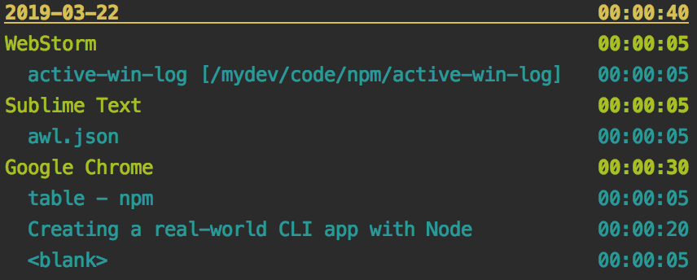

# active-win-log

> A command line tool for logging time spent viewing application windows.

<!--[]-->

<!--[RM_BADGES]-->
[](http://npm.im/active-win-log)
[](https://github.com/semantic-release/semantic-release)
[](https://coveralls.io/github/uglow/active-win-log?branch=master)
[](https://david-dm.org/uglow/active-win-log#info=dependencies)
[](https://david-dm.org/uglow/active-win-log#info=devDependencies)


## Install

    npm install -g active-win-log


<!--[]-->

## Usage

```
$ awl -?

Usage: awl <options>
awl           Start monitoring the active window
awl -?        This help information
awl -l n      Display statistics for the last "n" days in the log
awl -q        Stop monitoring
Log location: /users/<your user name>/active-win-log/awl.json

```

## Sample output
Command: `awl -l 1`


## Contributing

PRs are welcome. See [CONTRIBUTING.md](CONTRIBUTING.md).

## Motivation

I use this tool to give me a better sense of how I am spending my time when working out of the office. The tool checks
to see what the active window is (using [active-win](https://www.npmjs.com/package/active-win)) _every 5 seconds_. 

## License

This software is licensed under the MIT Licence. See [LICENSE](LICENSE).


